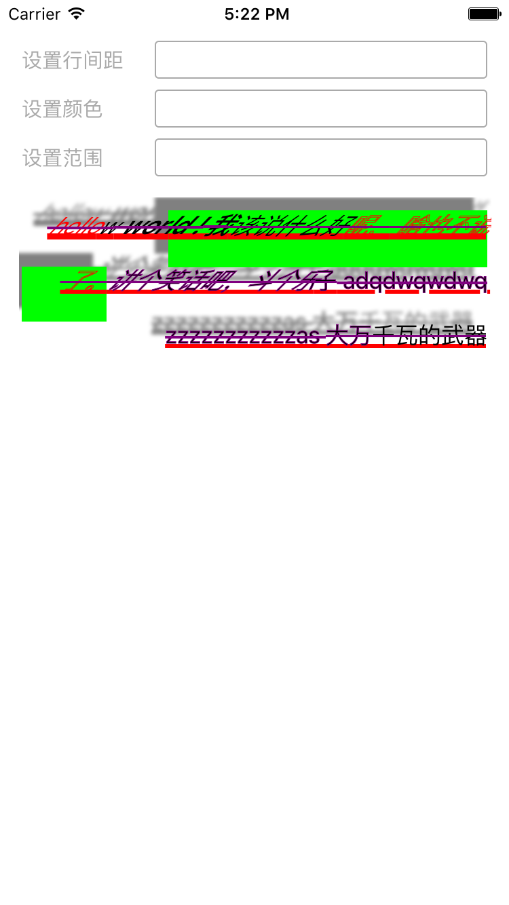

# AttributeString-Text
精品 - 纯代码 swift ios  行间距 图文混排列 字体 属性 颜色 &lt;夜黑执事 出品> — Edit

### 1 字体颜色

```
NSForegroundColorAttributeName  字体颜色

```

### 2 字体大小

```
NSFontAttributeName  字体大小

```


### 3 背景色
```
NSBackgroundColorAttributeName  背景色

```


### 4 段落
```
NSParagraphStyleAttributeName  段落

```


### 5 空心字 实体字
```
NSStrokeColorAttributeName NSStrokeWidthAttributeName（有正负效果）   空心字 实体字 2个都要

```



### 代码


